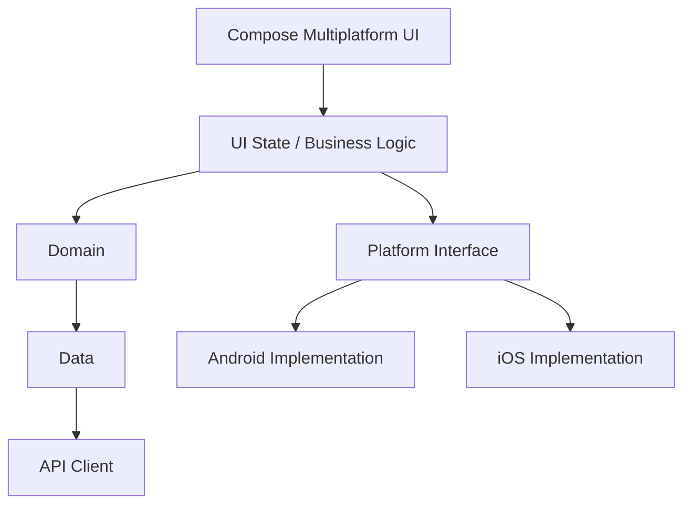

<p>
  <b>뛰뛰야 밥먹자</b>
</p>


> **내 주변 주유소의 유가를 쉽고 빠르게 비교하고, 더 합리적인 주유소를 선택할 수 있도록 돕는 위치 기반 유가 정보 서비스**


<br>

| 주변 주유소 | 주유소 상세 | 조회 설정 | 알림 설정 |
| ------ | ------ | ---- | ----- |
|  |  |  |  |


<br>

## 1. About

**뛰뛰야 밥먹자**는 사용자의 현재 위치를 기반으로 주변 주유소와 실시간에 가까운 유가 정보를 제공하는 서비스입니다.

사용자는 지도에서 주변 주유소를 탐색하고, 거리와 가격 등의 조건을 기준으로 주유소를 비교할 수 있습니다.

단순히 유가 정보를 보여주는 것에 그치지 않고,

* 위치 기반 주변 주유소 탐색
* 반경별 주유소 조회
* 유종별 가격 비교
* 주유소 상세 정보 확인
* 즐겨찾기
* 가격 변동 알림
* 사용자별 기본 유종 및 검색 조건 관리

등의 기능을 하나의 서비스에서 제공하는 것을 목표로 개발했습니다.

클라이언트는 **Kotlin Multiplatform 기반으로 Android와 iOS를 모두 지원**하며, Backend API부터 데이터베이스, 외부 데이터 연동, 배포 인프라까지 직접 설계하고 개발한 프로젝트입니다.

<br>

## 2. Why?

기존의 주유소 검색 경험에서는 단순히 가까운 주유소를 찾는 것보다,

> **“현재 위치에서 실제로 갈 만한 거리 안에 있는 주유소 중 내가 사용하는 유종이 가장 저렴한 곳은 어디인가?”**

라는 질문에 빠르게 답을 얻는 것이 중요하다고 생각했습니다.

이를 위해 서비스의 핵심 사용자 흐름을 다음과 같이 정의했습니다.

```text
현재 위치 확인
      ↓
주변 주유소 검색
      ↓
검색 반경 / 유종 / 정렬 조건 설정
      ↓
주유소별 가격 비교
      ↓
상세 정보 확인
      ↓
즐겨찾기 또는 길찾기
```

또한 즐겨찾기한 주유소의 가격을 사용자가 매번 직접 확인하지 않아도 되도록 가격 변동 및 목표 가격 기반 알림 기능을 함께 설계했습니다.

<br>

# 3. Client Architecture

KMP Client에서는 Android와 iOS에서 공유할 수 있는 영역과 플랫폼 종속적인 영역을 구분했습니다.



공통 영역에서는 가능한 많은 UI와 비즈니스 로직을 공유하되, 플랫폼 특성이 강한 기능까지 무리하게 공통화하지 않는 방향으로 설계했습니다.

### Shared

```text
UI
State
Filter
Business Logic
API Communication
Domain Model
```

### Android / iOS Native

```text
Location Permission
Device Verification
Authentication Token Storage
Lifecycle
External Navigation
Platform API
```

예를 들어 지도에서 사용되는 검색 조건과 화면 상태는 공통 영역에서 관리할 수 있지만,

위치 권한 요청이나 Android Play Integrity, iOS DeviceCheck와 같은 기능은 각 플랫폼의 구현이 필요합니다.

이를 공통 코드 내부에서 직접 처리하기보다 플랫폼별 구현체를 통해 연결하도록 구성했습니다.

<br>

# 4. Tech Stack

## Client

| Category      | Technology               |
| ------------- | ------------------------ |
| Language      | Kotlin                   |
| Multiplatform | Kotlin Multiplatform     |
| UI            | Compose Multiplatform    |
| Android       | Android                  |
| iOS           | iOS                      |
| Async         | Kotlin Coroutines / Flow |
| Map           | Naver Map                |
| Network       | Ktor                     |
| DI            | Koin                     |
| Serialization | Kotlin Serialization     |
| Local Storage | DataStore                |

---

## Backend

| Category       | Technology             |
| -------------- | ---------------------- |
| Language       | Kotlin                 |
| Framework      | Spring Boot            |
| API            | REST API               |
| ORM            | Spring Data JPA        |
| Database       | PostgreSQL             |
| Migration      | Flyway                 |
| Authentication | JWT / OAuth            |
| External Data  | Knoc API               |
| Test           | JUnit / Testcontainers |

---

## Infrastructure

| Category         | Technology |
| ---------------- | ---------- |
| Cloud            | AWS EC2              |
| Database         | PostgreSQL           |
| Container        | Docker               |
| Reverse Proxy    | Nginx                |
| Artifact Storage | AWS S3               |
| CI/CD            | Jeknins, Git Actions |

<br>

# 5. System Architecture


<br>

# 6. Design Decisions

## 01. 왜 KMP를 선택했는가?

Android와 iOS에서 동일한 비즈니스 로직과 UI 상태를 각각 구현하면 기능이 증가할수록 플랫폼 간 동작 차이와 유지보수 비용도 함께 증가합니다.

뛰뛰야 밥먹자는 핵심 서비스 경험이 두 플랫폼에서 크게 다르지 않기 때문에 KMP를 기반으로 공통 영역을 구성했습니다.

다만 모든 기능을 공통화하는 것을 목표로 하지는 않았습니다.

```text
공유해서 얻는 이점이 큰 영역
        ↓
Shared

플랫폼 종속성이 높은 영역
        ↓
Native
```

이라는 기준으로 책임을 나누었습니다.

이를 통해 코드 공유율 자체를 높이는 것보다 **두 플랫폼에서 동일한 서비스 규칙을 유지하면서도 Native 기능을 자연스럽게 사용할 수 있는 구조**를 만드는 데 초점을 맞췄습니다.

---

## 02. 왜 Client가 외부 API를 직접 호출하지 않는가?

Client가 외부 API에 직접 의존하거나 사용자 요청마다 Backend가 외부 API를 호출하면 서비스 트래픽과 외부 API 호출량이 강하게 결합됩니다.

따라서

```text
External Data Collection
```

과

```text
User Data Query
```

를 별도의 흐름으로 분리했습니다.

사용자 조회는 PostgreSQL에서 처리하고 외부 API는 Data Synchronization 용도로만 사용합니다.

이를 통해 외부 API 장애, Latency 및 Rate Limit이 사용자 요청에 미치는 영향을 줄일 수 있습니다.
| 이로 인해 외부 API와의 Data Synchronization 정책을 어떻게 설계하고, 구현할 것인지가 가장 중요합니다.

---

## 03. 왜 비회원 기능에도 Device Verification이 필요한가?

비회원 이용 횟수를 단순 Local Preference에 저장하면 사용자가 앱 데이터를 삭제하거나 다시 설치하는 것만으로 제한을 초기화할 수 있습니다.

하지만 회원가입을 강제하면 처음 서비스를 사용하는 사용자에게 진입 장벽이 생깁니다.

따라서

```text
Guest Experience
        +
Device-based Policy
```

를 결합했습니다.

사용자는 로그인하지 않고도 서비스를 체험할 수 있지만, 서버에서는 검증된 디바이스를 기준으로 정책을 적용합니다.

<br>

# 7. Challenges

### 외부 API 호출과 사용자 API 분리

사용자가 주유소를 검색할 때마다 외부 API에 요청하는 단순 구조 대신 내부 DB와 Sync Layer를 추가했습니다.

그 결과 서비스 조회 흐름과 외부 데이터 수집 흐름을 독립적으로 관리할 수 있는 구조를 만들었습니다.

### Cross-platform과 Native 책임 구분

KMP를 사용하면서 모든 코드를 공통 영역으로 옮기기보다 위치 권한, Device Verification, Token Storage 등 플랫폼 기능은 Native가 담당하도록 분리했습니다.

### 비회원 사용성과 서비스 정책의 균형

회원가입 이전에도 서비스를 충분히 경험할 수 있도록 비회원 사용을 허용하면서 Device Verification과 서버 Counter를 활용해 이용 정책을 서버에서 일관되게 관리하도록 설계했습니다.

- Naver Map KMP 연동 (공식적으로 Naver Map은 Compose, KMP를 지원하지 않는 문제가 있다.)
- iOS / Android Location 차이
- KMP Navigation
- Push Notification
- 배포 자동화
- PostgreSQL 위치 검색 Query
- 외부 API 데이터 정합성 문제

<br>

# 8. What I Learned

뛰뛰야 밥먹자를 개발하면서 단순히 하나의 Client Application을 만드는 것을 넘어, 사용자의 요청이 데이터베이스와 외부 API, 인증 시스템, 배포 환경까지 어떤 흐름으로 전달되는지를 전체 서비스 관점에서 설계했습니다.

특히 다음 세 가지를 프로젝트의 중요한 설계 기준으로 삼았습니다.

**첫째, 외부 시스템과 핵심 서비스의 결합도를 낮추는 것.**

외부 API 호출과 사용자 조회를 분리하면서 외부 API가 서비스의 응답성과 가용성을 직접 결정하지 않도록 구조를 변경했습니다.

**둘째, Cross-platform이라는 이유만으로 모든 구현을 공통화하지 않는 것.**

KMP의 장점은 최대한 활용하면서 위치 권한, Device Verification 등 플랫폼 의존성이 높은 기능은 Android와 iOS가 각각 책임지도록 구분했습니다.

**셋째, 기능 구현뿐만 아니라 실제 운영 상황까지 고려하는 것.**

Guest 이용 제한, Device Verification, 데이터 동기화, API 로그, Database Migration, Test, Backup과 Deployment까지 함께 구성하면서 하나의 기능이 실제 서비스 환경에서 지속적으로 운영되기 위해 필요한 요소를 경험했습니다.

이 프로젝트를 통해 Client와 Backend를 개별 기술 영역으로 바라보기보다,

> **사용자의 한 번의 요청이 Client부터 Server, Database, External API 그리고 Infrastructure를 거쳐 어떻게 완성되는가**

를 기준으로 시스템을 설계하는 경험을 쌓았습니다.

<br>

